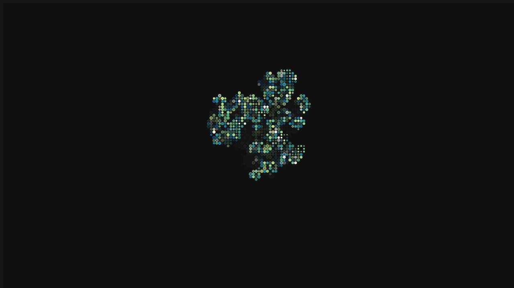

# Game of Life

A visual implementation of Conway's Game of Life built with p5.js. Random walkers continuously seed new living cells, which evolve according to the classic rules of cellular automata — survival, death, and birth based on neighbour count.

## Getting started

Install dependencies and start the dev server with `npm install && npm run dev`. Drag the mouse over the canvas to manually add living cells.
